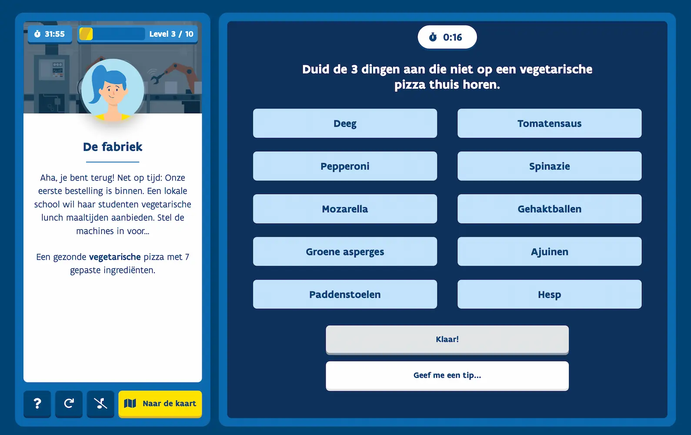

# Sollicitatie-test FE-development   [Magali Fabri](https://github.com/magalifabri)   11/2022

### **View project on [lmr-test.vercel.app](https://lmr-test.vercel.app/)**

 

## Running for development

To set up the app for local development, follow these steps:

1. clone the repository: `git clone git@github.com:magalifabri/lmr-test.git`
2. go into the repository: `cd lmr-test`
3. install the dependancies: `npm i`
4. run the app locally: `npm run dev`
5. go to http://localhost:3000 in your browser to view the app

 

## Tech

Built with [Next.js](https://nextjs.org/), using [TypeScript](https://www.typescriptlang.org/), [Sass](https://sass-lang.com/) and [Framer Motion](https://www.framer.com/motion/) as core building blocks. And deployed with [Vercel](https://vercel.com/home).

Random advice given as hints from [Advice Slip JSON API](https://api.adviceslip.com/)

 

## Screenshots

<figure>
    
<figcaption>On desktop</figcaption>
</figure>

 

<figure>

<figcaption>On mobile</figcaption>
</figure>
